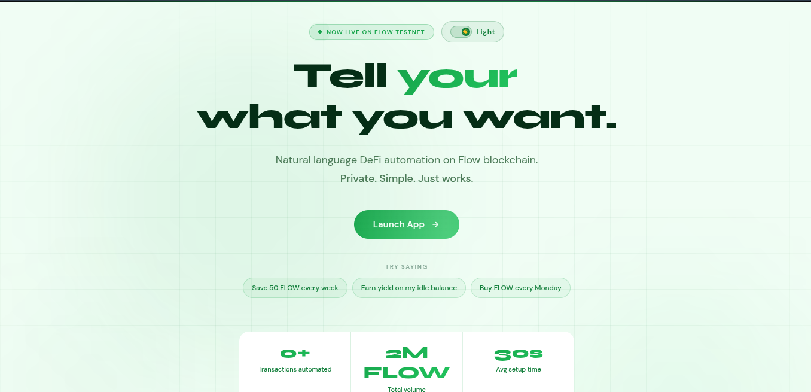
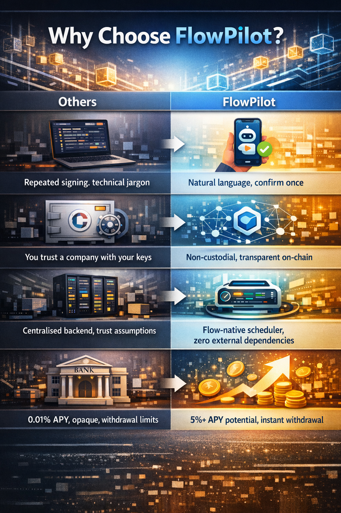

<div align="center">

# FlowPilot

### Tell your wallet what you want. It handles the rest.

Consumer DeFi automation on Flow blockchain — describe a financial goal in plain English, confirm once, and let on-chain automation execute continuously, privately, and without a backend.

[](https://flow.com)
[](https://cadence-lang.org)
[](https://cloud.near.ai)
[](https://nextjs.org)
[](./LICENSE)

<!-- PLACEHOLDER: Replace with your live demo link once deployed -->
[🚀 Live Demo](#) · [📺 Watch Demo Video](#demo-video) · [📖 Docs](#9-setup)

</div>

---

## 📺 Demo Video

[](https://youtu.be/Aism6USHLdE)

---

## Table of Contents

1. [Problem & Solution](#1-problem--solution)
2. [How It Works](#2-how-it-works)
3. [Architecture](#3-architecture)
4. [Tech Stack](#4-tech-stack)
5. [Smart Contracts](#5-smart-contracts)
6. [V2 Rule Lifecycle](#6-v2-rule-lifecycle)
7. [Why FlowPilot](#7-why-flowpilot)
8. [Current Status](#8-current-status)
9. [Setup](#9-setup)
10. [Repository Structure](#10-repository-structure)
11. [Hackathon Criteria](#11-hackathon-criteria)
12. [Acknowledgments](#12-acknowledgments)

---

## 1. Problem & Solution


### The Problem

DeFi is too complex for mainstream adoption. Every action requires manual transaction signing, technical jargon, and constant monitoring. Recurring tasks — auto-saves, dollar-cost averaging, yield routing — demand either custodial services (give up your keys) or constant user attention (give up your time). Neither is acceptable for the next billion users.

### The Solution

FlowPilot turns intent into automation:

```
"Save 50 FLOW every week"  →  One confirmation  →  Runs automatically on-chain
```

1. User types a goal in plain English
2. NEAR AI parses intent privately inside a Trusted Execution Environment (TEE)
3. A human-readable plan is shown — no surprises, no hidden logic
4. User signs once; Flow's native scheduler executes recurring actions forever

No backend. No keeper bots. No custodial trust. Just on-chain automation.

---

## 2. How It Works

<!-- PLACEHOLDER: Replace with a step-by-step flow illustration (annotated screenshot or diagram) -->


| Step | Action | What Happens |
|------|--------|--------------|
| **1 — Connect** | Link your Flow wallet via FCL | Email-compatible, no seed phrase required |
| **2 — Describe** | Type a goal in plain English | e.g. *"Save 50 FLOW a week and earn yield on idle balance"* |
| **3 — Review** | NEAR AI parses intent inside a TEE | A human-readable plan is shown before any transaction is signed; your financial intent never touches a centralised API |
| **4 — Confirm** | Sign once | Rules are stored on-chain in `AutomationRulesV2` |
| **5 — Automate** | Flow Transaction Scheduler executes the handler | Self-reschedules after each run — infinite recurring automation, zero backend |

---

## 3. Architecture

### System Overview


### V2 Rule Lifecycle


---

## 4. Tech Stack

| Component | Technology | Purpose |
|-----------|-----------|---------|
| **Frontend** | Next.js 15 + TypeScript | App Router, responsive dashboard UI |
| **Wallet / Auth** | Flow FCL | Email-compatible, no seed phrase required |
| **Smart Contracts** | Cadence V2 | Resource-safe vault and automation rule logic |
| **Automation** | Flow Transaction Scheduler | Native on-chain scheduling — no backend, no keeper network |
| **AI Inference** | NEAR AI — DeepSeek-V3.1 (TEE) | Private intent parsing, zero centralised logging |
| **Yield** | Increment Finance + Flowty | Real on-chain yield integrations |
| **Containerisation** | Docker + docker-compose | Reproducible dev and deployment environment |
| **Styling** | Inline React Styles | Zero-dependency, self-contained UI |

---

## 5. Smart Contracts

> All contracts are deployed on Flow **Testnet** at `0xbd9a0dc67c96cda1`

### `FlowPilotVault.cdc`

A resource-based vault with automatic yield calculation (~5% APY). The Cadence resource model means the vault **cannot be duplicated or lost** — safety is enforced by the type system, not just audits. Stored at `/storage/flowPilotVault` in each user's account.

### `AutomationRulesV2.cdc`

Stores action type, amount, interval, active status, and the current scheduler ID fully on-chain. Exposes `setSchedulerId()` and `markRuleExecuted()` so the handler can update rule state after each execution. Provides a `RuleBookPublic` capability interface for handler access.

### `VaultSaveHandlerV2.cdc`

Implements the `TransactionHandler` interface for the Flow Transaction Scheduler. Executes vault deposits, self-reschedules for infinite recurring automation, and updates rule state on-chain after every run. Users maintain full custody — no backend keys are ever involved.

---

## 6. V2 Rule Lifecycle

The V2 architecture resolves a critical **stale-ID failure mode** present in V1, where rule cancellation could silently fail if the rule had already executed and rescheduled under a new scheduler ID.

**The fix:** the rule always stores the latest scheduler ID on-chain. `cancel()` reads the current on-chain value rather than a client-side one — so cancellation is always valid, never stale.

1. Rule is created in `AutomationRulesV2`
2. Scheduler ID is persisted on-chain via `setSchedulerId()`
3. Handler executes, self-reschedules, updates the scheduler ID via `markRuleExecuted()`
4. Cancellation reads the current scheduler ID from the rulebook — always valid

---

## 7. Why FlowPilot

<!-- PLACEHOLDER: Replace with a comparison visual or infographic -->


| | Others | FlowPilot |
|---|---|---|
| **vs Manual DeFi** | Repeated signing, technical jargon | Natural language, confirm once |
| **vs Custodial Apps** | You trust a company with your keys | Non-custodial, transparent on-chain |
| **vs Keeper Bots** | Centralised backend, trust assumptions | Flow-native scheduler, zero external dependencies |
| **vs Traditional Banks** | 0.01% APY, opaque, withdrawal limits | 5%+ APY potential, instant withdrawal |

### Unique Differentiators

**Privacy-first AI** — The only Consumer DeFi platform using TEE-secured inference. Your financial goals never touch a centralised provider.

**Resource-oriented safety** — Cadence's type system makes asset duplication or loss mathematically impossible, not just "safe by audit."

**True on-chain automation** — The Flow Transaction Scheduler runs on the blockchain itself, not a centralised keeper network.

**Consumer-ready UX** — Email login, no seed phrases, natural language input — designed for the next billion users.

---

## 8. Current Status

### ✅ Implemented (Testnet)

- Rule CRUD — create, read, and cancel automation rules
- On-chain scheduler ID lifecycle (`setSchedulerId`, `markRuleExecuted`)
- Recurring save handler with self-reschedule
- Verified multiple recurring executions on testnet
- Vault deposit and withdrawal
- Dashboard: balance, pending yield, activity feed, rule management
- Private intent parsing via NEAR AI (TEE-backed inference)
- Real yield integrations (Increment Finance, Flowty)
- Full gas sponsorship path
- DCA execution path
- V2 contract architecture with stale-ID failure mode fully resolved

### 🗺️ Roadmap

- Mainnet deployment
- Multi-token vault support
- More automation templates (rebalancing, stop-loss)
- Mobile-optimised interface

---

## 9. Setup

### Prerequisites

- Node.js 18+
- npm
- Flow CLI

### Install & Run

```bash
git clone https://github.com/jerrygeorge360/flowpilot.git
cd flowpilot
npm install
```

Create `.env.local`:

```env
NEAR_AI_API_KEY=your_key_here
NEXT_PUBLIC_FLOW_NETWORK=testnet
NEXT_PUBLIC_VAULT_CONTRACT=0xbd9a0dc67c96cda1
NEXT_PUBLIC_RULES_CONTRACT=0xbd9a0dc67c96cda1
NEXT_PUBLIC_HANDLER_CONTRACT=0xbd9a0dc67c96cda1
```

```bash
npm run dev
# Open http://localhost:3000
```

### Run with Docker

```bash
docker-compose up --build
```

### Deploy Your Own Contracts (Optional)

```bash
flow keys generate
# Fund your account at https://testnet-faucet.onflow.org
# Update flow.json with your account details
flow project deploy --network testnet
```

---

## 10. Repository Structure

```
flowpilot/
├── app/
│   ├── dashboard/
│   │   └── page.tsx              # Main dashboard UI
│   └── api/
│       ├── parse-intent/
│       │   └── route.ts          # NEAR AI intent parsing endpoint
│       ├── get-balance/
│       │   └── route.ts          # Vault metrics endpoint
│       ├── get-rules/
│       │   └── route.ts          # Rules endpoint
│       └── sponsor-transaction/  # Gas sponsorship endpoint
├── components/
│   ├── ChatInput.tsx             # Natural language goal input
│   ├── PlanPreview.tsx           # Human-readable plan before execution
│   ├── BalanceCard.tsx           # Balance, yield, withdraw UI
│   ├── ManageRules.tsx           # Rule management interface
│   ├── ActivityFeed.tsx          # On-chain event feed
│   └── WithdrawModal.tsx         # Withdrawal flow
├── context/                      # React context providers
├── lib/
│   ├── cadence.ts                # Transaction & query helpers
│   ├── flow.ts                   # FCL configuration
│   └── nearai.ts                 # NEAR AI client + prompts
├── cadence/
│   ├── contracts/
│   │   ├── FlowPilotVault.cdc
│   │   ├── AutomationRulesV2.cdc
│   │   └── VaultSaveHandlerV2.cdc
│   ├── transactions/
│   └── scripts/
├── prisma/                       # Database schema
├── Dockerfile
├── docker-compose.yml
├── flow.json
└── README.md
```

---

## 11. Hackathon Criteria

| Criterion | How FlowPilot Delivers |
|-----------|----------------------|
| **Impact / Usefulness** | Removes DeFi friction for mainstream users. Automates recurring financial discipline without custodial risk or technical knowledge. |
| **Technical Execution** | Cadence V2 resource model + Flow Transaction Scheduler integration. V2 on-chain scheduler ID lifecycle resolves the stale-ID failure mode found in V1. |
| **Completeness / Functionality** | End-to-end flow live on testnet — rule CRUD, vault deposit/withdrawal, balance + yield dashboard, activity feed, recurring execution verified, full gas sponsorship path. |
| **Scalability / Future Potential** | Architecture directly supports DCA, portfolio rebalancing, and real yield routing. Consumer UX foundation is ready for a mainnet rollout and broader user base. |
| **Collaboration / Ecosystem** | Builds on Flow's native primitives (Cadence, FCL, Transaction Scheduler) and integrates NEAR AI's privacy infrastructure — demonstrating cross-ecosystem technical collaboration. |

---

## 12. Acknowledgments

- [Flow Foundation](https://flow.com) — consumer-friendly L1, Cadence language, native on-chain scheduling
- [NEAR AI](https://cloud.near.ai) — private, TEE-secured inference infrastructure
- [Increment Finance](https://app.increment.fi) — yield integration
- [Flowty](https://flowty.io) — yield integration
- Flow Community — FCL, documentation, testnet faucet support

---

<div align="center">

Built for **Flow: The Future of Finance** (Consumer DeFi Track) · PL_Genesis Hackathon · March 2026

[GitHub](https://github.com/jerrygeorge360/flowpilot) · [Twitter](#) · [Discord](#)

</div>